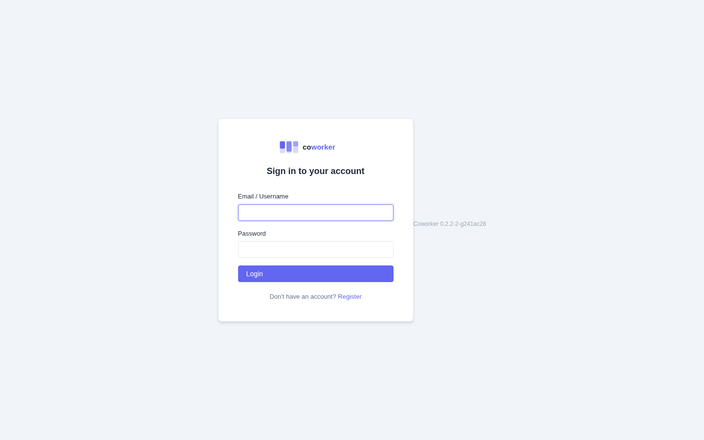
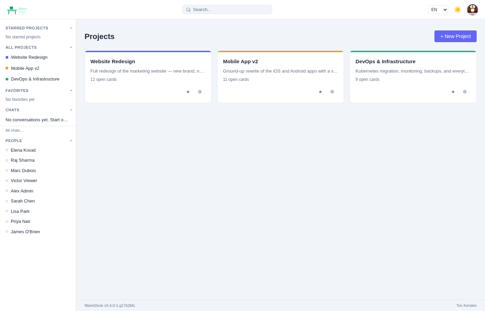
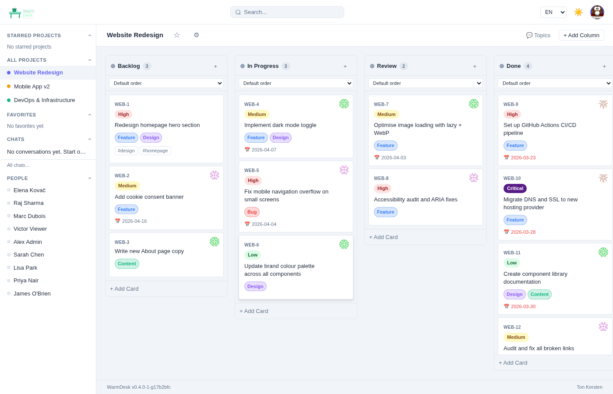
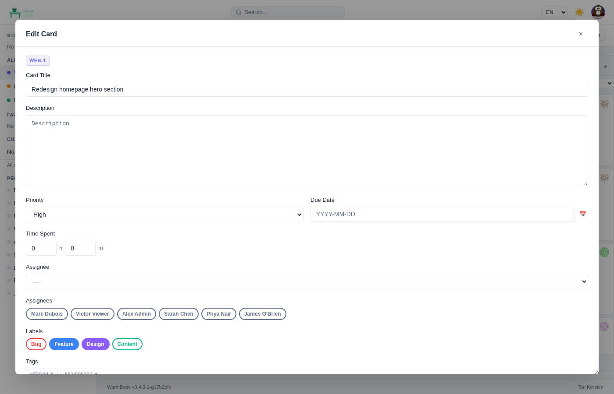
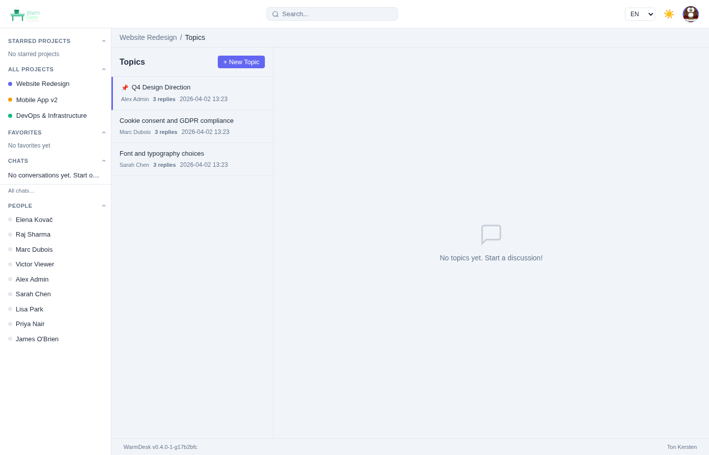
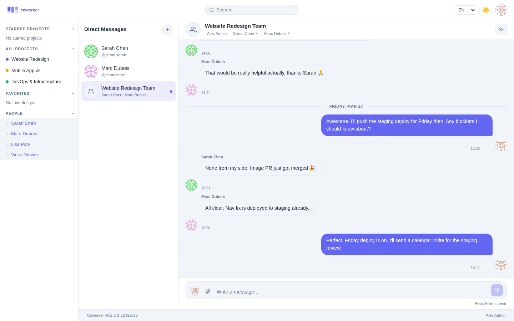
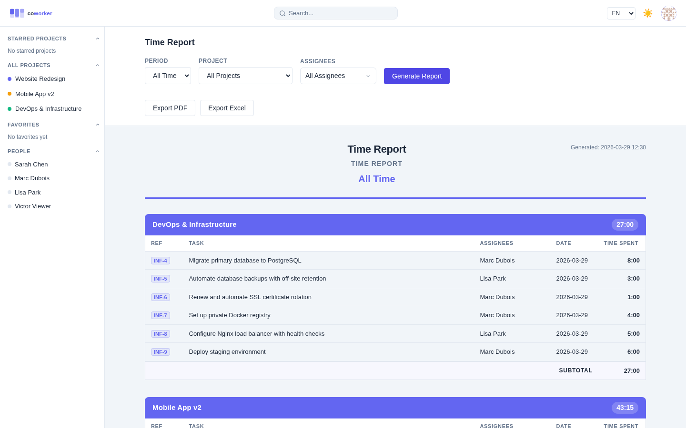
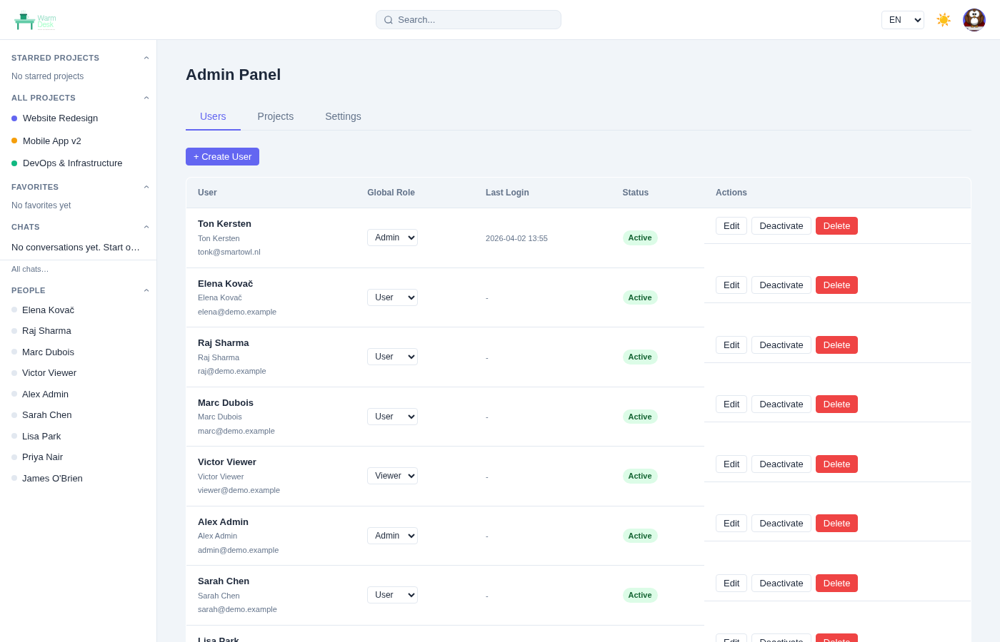
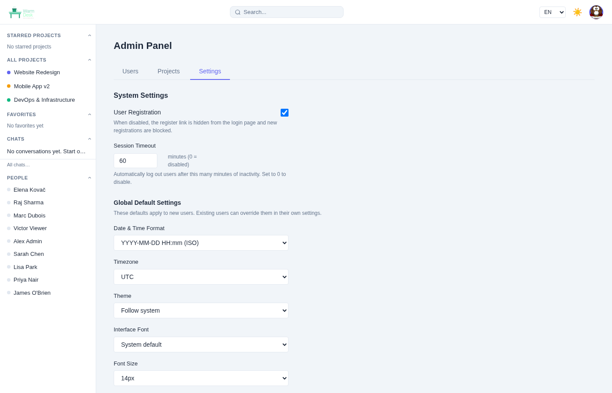
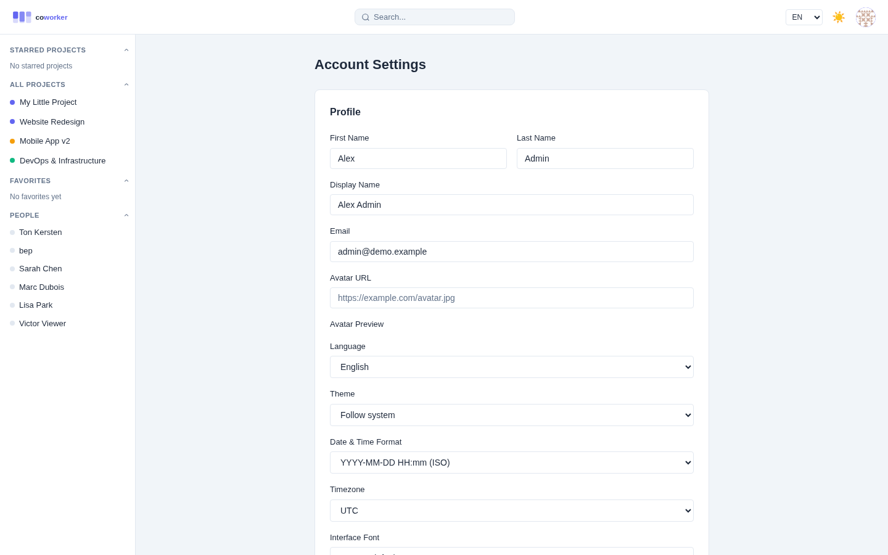

<p align="center">
  
</p>

# WarmDesk

A self-hosted, multi-user project management tool with Kanban boards, real-time
collaboration, direct messaging, time tracking, and a ticket API.

## Build status

[](https://github.com/tonk/warmdesk/actions/workflows/release.yml)

## Experiment

This is an experiment, and a biggie :-)

I haven't written a single line of code, I only created and updated `what.md`
and asked Claude Code to generate the app.

## Screenshots

| | |
|---|---|
|  |  |
| *Login* | *Dashboard* |
|  |  |
| *Kanban board* | *Card detail with checklist, comments and time tracking* |
|  |  |
| *Threaded project discussions* | *Direct messages and group chat* |
|  |  |
| *Time report with PDF/Excel export* | *Admin panel — user management* |
|  |  |
| *Admin settings* | *User settings* |

## Features

- **Kanban boards** — columns, cards, drag-and-drop reorder, labels, priorities, due dates, assignees, watchers, markdown descriptions and comments
- **Card sorting** — sort column cards by date, assignee, or priority (ascending / descending)
- **Copy card** — duplicate a card within the same column with one click
- **Transfer card** — copy or move a card to any other project you have access to; choose the destination project and column
- **Close / reopen cards** — mark cards as closed; closed cards stay on the board with a strikethrough and muted style and can be reopened at any time
- **Comment replies** — reply to any comment; replies are visually indented
- **Time tracking** — log hours and minutes spent directly on a card
- **Multi-project** — each project has its own board, members, and chat; open card counts shown on project tiles and in the admin panel
- **Role-based access** — global roles (admin / user / viewer) and per-project roles (owner / admin / member / viewer); project admins can manage columns
- **Real-time** — board changes, card moves, and chat messages sync instantly across all connected users via WebSocket
- **Internal chat** — per-project team chat and direct messages between users; group chats support custom avatars and member management
- **Start team chat from DM** — open the Teams tab in Direct Messages to instantly start a group chat with all members of a project
- **Unread DM notifications** — pulsing indicator in the sidebar and header when there are unread direct messages
- **Sidebar** — starred projects, live online-users list, auto-refreshes when users are added or removed; drag the inner edge to resize (width persisted)
- **Dark / light / system theme** — defaults to light
- **Multi-language** — English, Dutch (Nederlands), German (Deutsch), Spanish (Español), French (Français)
- **User settings** — display name, avatar, email, locale, theme, date/time format, timezone, font, password change
- **Admin panel** — manage all users (create, edit, assign projects, disable, delete) and all projects; toggle public registration on/off; configure global defaults (theme, locale, date format, timezone, font); configure SMTP email; set company name and logo
- **SMTP email** — configurable from the admin panel without a server restart; username and password are optional for relay servers
- **Session timeout** — configurable idle timeout (default 60 minutes); set to 0 to disable
- **Topics** — threaded discussions per project with markdown support and replies
- **Checklists** — add checklist items to cards with completion tracking
- **Multiple assignees** — assign more than one user to a card
- **Watchers** — subscribe to card activity
- **Favourite people** — mark users for quick access
- **Time reports** — generate a time overview filtered by period (all / year / month / week), project, and one or more assignees; export to PDF (report only, no sidebar) or Excel (XLSX); time displayed as H:MM
- **Company branding** — set a company name and logo that appears on reports
- **Configurable initial columns** — admin can define which columns are created when a new project is made (defaults to "Backlog")
- **Ticket API** — create cards, add comments, and move cards via API key (for CI/CD pipelines and external integrations); API keys also work on all other authenticated endpoints
- **Project-scoped API keys** — keys created in Project Settings are locked to that project; personal API keys in User Settings give full access across all projects
- **Git integration** — connect GitHub, GitLab, Gitea, or Forgejo; commit/PR/issue events post to project chat and automatically link to cards when a card reference (e.g. `PRJ-42`) appears in the message or title
- **Database support** — SQLite (zero configuration), PostgreSQL, MySQL/MariaDB
- **Horizontal scaling** — Redis pub/sub for multi-instance WebSocket broadcast
- **App zoom** — `Ctrl +` / `Ctrl -` to zoom in/out; `Ctrl 0` to reset; level persisted across sessions
- **Desktop app** — native Tauri app for Linux (AppImage), macOS (DMG), and Windows (installer); server URL configurable from the login page at any time; supports `--version` and `--maximized` CLI flags
- **Project migration** — `warmdesk-export` and `warmdesk-import` standalone tools to migrate projects to/from Jira, Trello, OpenProject, or Ryver; column mapping via config file

## Quick Start

### Development

```bash
# Terminal 1 — backend (Go)
cd backend
go run .

# Terminal 2 — frontend (Vue 3 + Vite)
cd frontend
npm install
npm run dev
```

Open **http://localhost:5173** in your browser.

### Production build

```bash
make build
cd dist
WEB_DIR=./web ./warmdesk
```

Open **http://localhost:8080**.

### Load demo data

A seed tool is included in the distribution to populate the database with
realistic demo content (users, projects, cards, comments, time entries, topics,
and conversations):

```bash
cd dist
./warmdesk-seed           # seed demo data
./warmdesk-seed --reset   # wipe and re-seed
```

Demo accounts created (password for all: `demo1234`):

| Username | Display name | Global role | Notes |
|---|---|---|---|
| `tonk` | Ton Kersten | admin | Persistent — not removed by `--reset` |
| `demo.admin` | Alex Admin | admin | |
| `demo.sarah` | Sarah Chen | user | Project admin: Website Redesign |
| `demo.marc` | Marc Dubois | user | Project admin: Mobile App v2 |
| `demo.lisa` | Lisa Park | user | Project admin: DevOps & Infra |
| `demo.priya` | Priya Nair | user | |
| `demo.james` | James O'Brien | user | |
| `demo.elena` | Elena Kovač | user | |
| `demo.raj` | Raj Sharma | user | |
| `demo.viewer` | Victor Viewer | viewer | |

## Configuration

Copy the example config file and edit it:

```bash
cp warmdesk.yaml.example warmdesk.yaml
```

Settings can also be provided as environment variables, which always take precedence over the config file. Key options:

| Option | Env var | Default | Description |
|--------|---------|---------|-------------|
| `port` | `PORT` | `8080` | HTTP listen port |
| `db_driver` | `DB_DRIVER` | `sqlite` | `sqlite` / `postgres` / `mysql` |
| `db_dsn` | `DB_DSN` | `./warmdesk.db` | Database connection string |
| `db_tls_mode` | `DB_TLS_MODE` | *(off)* | `disable` / `require` / `verify-ca` / `verify-full` |
| `db_tls_ca_cert` | `DB_TLS_CA_CERT` | *(empty)* | Path to CA certificate file |
| `db_tls_cert` | `DB_TLS_CERT` | *(empty)* | Path to client certificate (mTLS) |
| `db_tls_key` | `DB_TLS_KEY` | *(empty)* | Path to client private key (mTLS) |
| `tls_cert` | `TLS_CERT` | *(empty)* | Path to server TLS certificate (enables HTTPS when set with `tls_key`) |
| `tls_key` | `TLS_KEY` | *(empty)* | Path to server TLS private key |
| `jwt_secret` | `JWT_SECRET` | *(change this)* | Secret for signing JWT tokens |
| `allowed_origins` | `ALLOWED_ORIGINS` | `http://localhost:8080` | CORS allowed origins |
| `default_locale` | `DEFAULT_LOCALE` | `en` | Default UI language for new users |
| `gin_mode` | `GIN_MODE` | `debug` | `debug` or `release` |
| `api_log` | `API_LOG` | `true` | Log incoming HTTP requests |
| `db_log` | `DB_LOG` | `info` | DB query log level: `silent` / `error` / `warn` / `info` |
| `upload_dir` | `UPLOAD_DIR` | `./uploads` | Directory for uploaded files |
| `max_upload_mb` | `MAX_UPLOAD_MB` | `25` | Maximum upload file size in MB |
| `base_url` | `BASE_URL` | *(empty)* | Public base URL (e.g. `https://desk.example.com`) — sets the host in Swagger UI |

See [INSTALL.md](INSTALL.md) for full options and deployment instructions.

## Tech Stack

| Layer | Technology |
|-------|-----------|
| Backend | Go 1.25, Gin, GORM, gorilla/websocket |
| Frontend | Vue 3, Vite, Pinia, vue-router, vue-i18n, EasyMDE, SheetJS |
| Database | SQLite / PostgreSQL / MySQL |
| Auth | JWT (access + refresh tokens), bcrypt |
| Desktop | Tauri 2 (Rust) |

## Ticket API

Automate ticket management from CI/CD pipelines or external tools using API keys.

API keys are personal (per user). Generate one under **Project Settings → API Keys**, or via the API while authenticated with a JWT:

```bash
curl -X POST http://localhost:8080/api/v1/auth/api-keys \
  -H "Authorization: Bearer <your_jwt_token>" \
  -H "Content-Type: application/json" \
  -d '{"name": "my-ci-key"}'
```

The full key (prefixed `cwk_...`) is returned **once only**. Then use it with any of the endpoints below.

```
POST  /api/v1/ticket/{slug}/cards                    — create a card
POST  /api/v1/ticket/{slug}/cards/{id}/comments      — add a comment
PATCH /api/v1/ticket/{slug}/cards/{id}/move          — move to a column
```

Pass the key in the `X-API-Key` header or as `?api_key=` query parameter. API keys work on all authenticated endpoints, not just the Ticket API.

## Git Integration

Connect GitHub, GitLab, Gitea, or Forgejo to automatically link commits, pull
requests, and issues to cards. Any commit message or PR/issue title that
contains a card reference (e.g. `PRJ-42`) creates a link visible in the card
detail. Events also post formatted messages to the project chat.

Setup: **Project Settings → Webhooks → Create Webhook** and choose the platform.
Full instructions in [docs/api.md](docs/api.md#4-git-platform-webhooks).

## Project Migration

Import from or export to Jira, Trello, OpenProject, or Ryver using the standalone migration tools included in every distribution:

```bash
./warmdesk-export --config warmdesk-migrate.yaml   # export WarmDesk → platform
./warmdesk-import --config warmdesk-migrate.yaml   # import platform → WarmDesk
```

Both tools support `--dry-run`. Missing credentials are prompted interactively. See `warmdesk-migrate.yaml.example` for full configuration options including column mapping.

## Documentation

| Document | Contents |
|----------|----------|
| [docs/user-guide.md](docs/user-guide.md) | End-user walkthrough of all features |
| [docs/api.md](docs/api.md) | Ticket API + webhook integration reference |
| [docs/admin-guide.md](docs/admin-guide.md) | Installation, configuration, SMTP, scaling, backup |

## Installation

See [INSTALL.md](INSTALL.md) for full instructions including:
- Building from source
- Running as a systemd service
- Nginx and Apache reverse proxy configuration
- PostgreSQL / MySQL setup
- First admin account setup

## Code Signing Policy

Windows binaries released by WarmDesk are code-signed through the
[SignPath Foundation](https://signpath.org) free code-signing programme for
open-source software.

- Code signing for WarmDesk is provided by **SignPath.io** / **SignPath Foundation**.
- Team members involved in the signing process:
  - **Ton Kersten** — project maintainer and signing approver
- No user data is collected or shared with any third party as part of the
  signing process.
