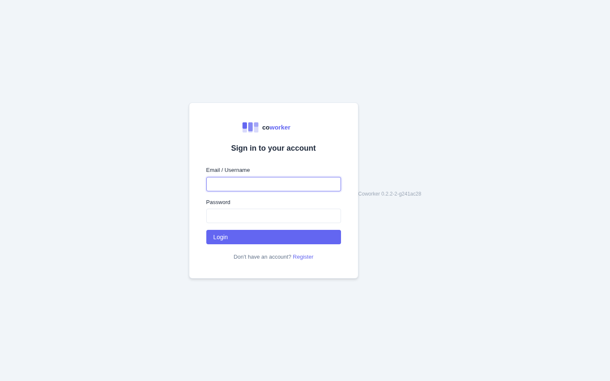
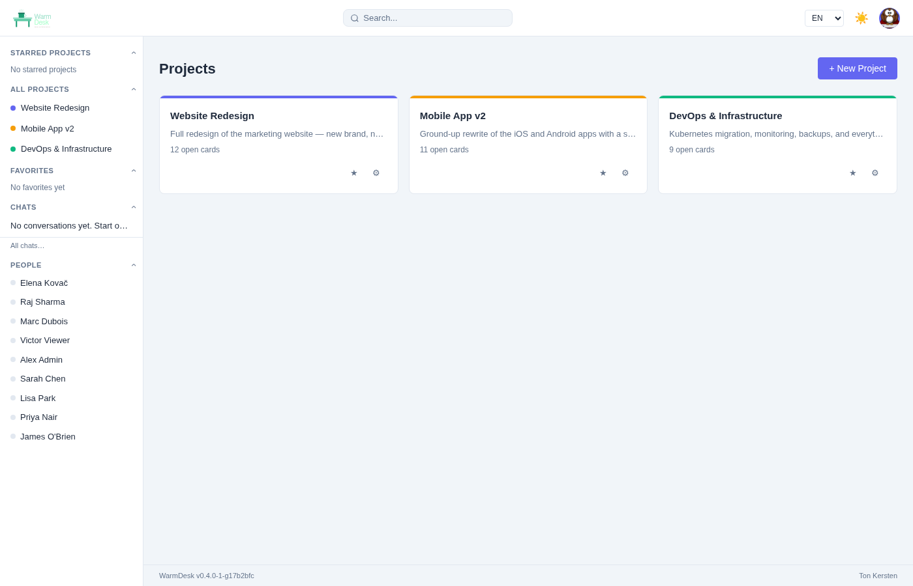
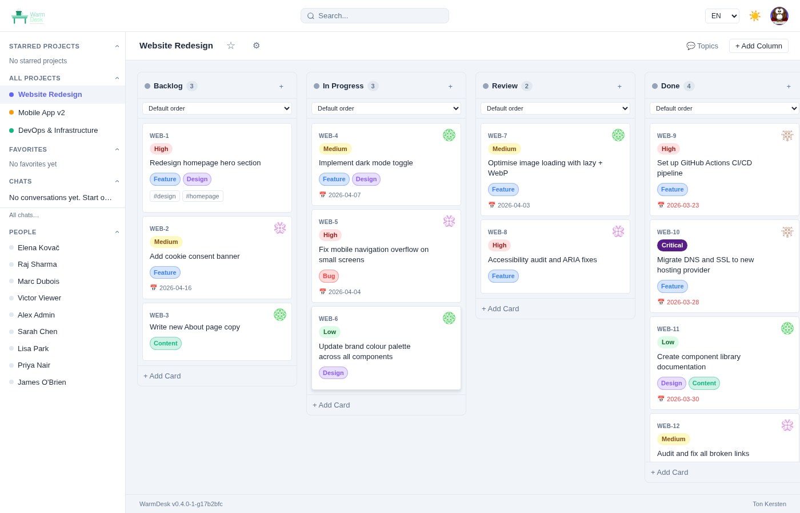
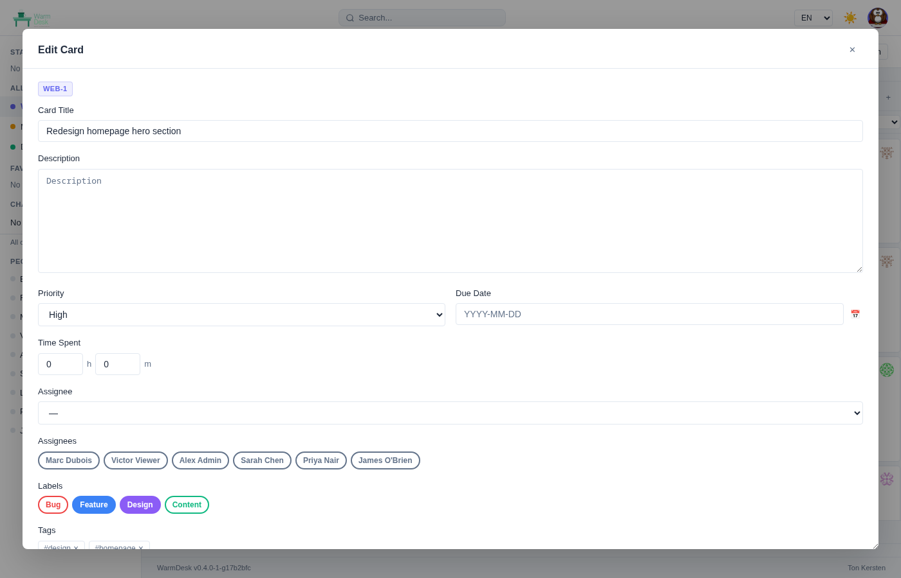
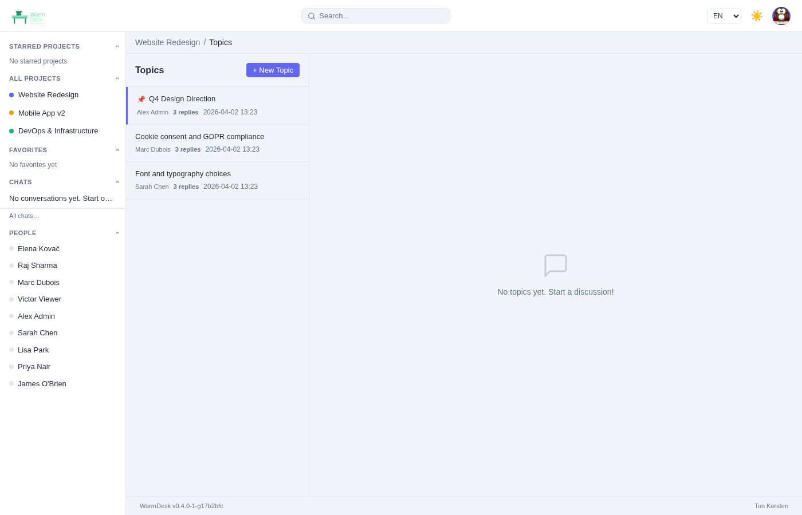
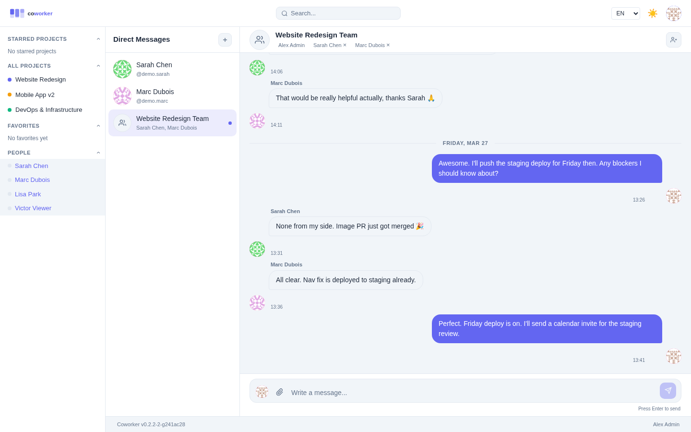
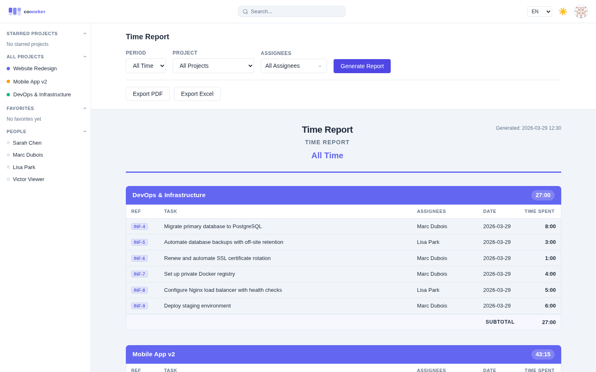
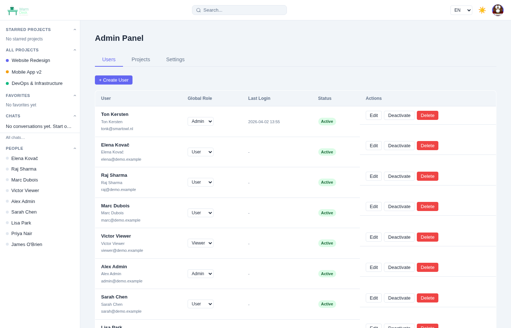
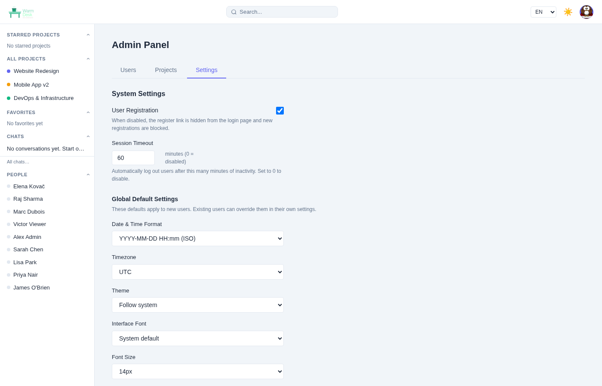
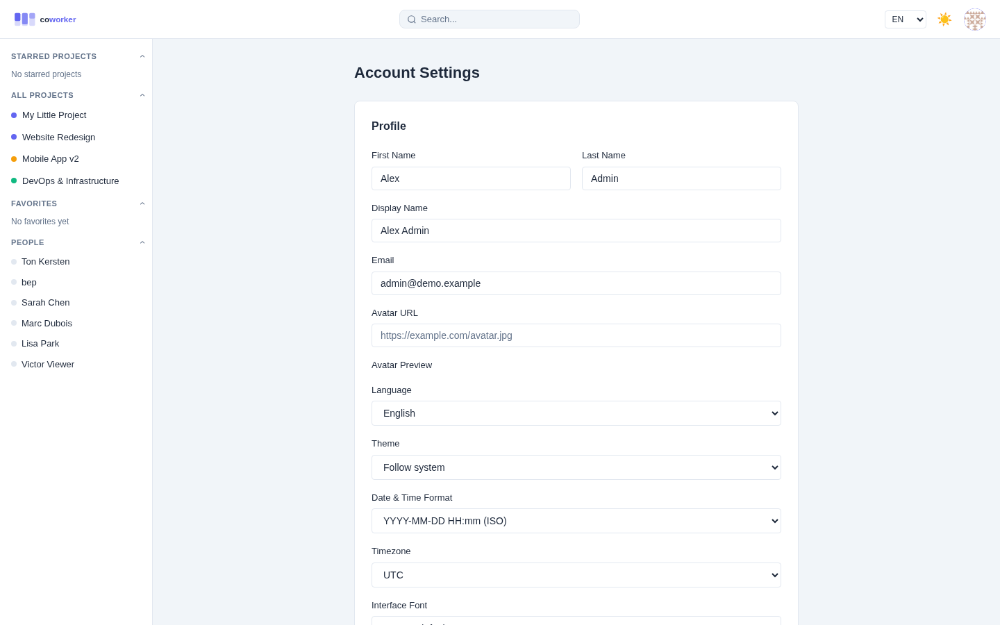

<p align="center">
  
</p>

# WarmDesk

A self-hosted, multi-user project management tool with Kanban and Scrum boards, real-time
collaboration, direct messaging with 1:1 and group video chat, time tracking, and a ticket API.

## Latest release (v0.26.2)

- **Fixed** — card titles with Markdown formatting (backticks, bold, etc.) now render correctly instead of showing the raw syntax, on board card tiles and in read-only title views.
- **Fixed** — ordered/unordered lists in rendered Markdown (card descriptions and comments, call chat, topic posts and replies) now have proper left indentation instead of sitting flush against the edge.

## Experiment

This is an experiment, and a biggie :-)

I (almost) haven't written a single line of code, I created and
updated the `what.md` file and asked Claude Code and Cursor to generate the app.
The result is a ~45,000 line Go backend and a ~45,000 line Vue 3 frontend that actually works.

## Screenshots

| | |
|---|---|
|  |  |
| *Login* | *Dashboard* |
|  |  |
| *Kanban board* | *Card detail with checklist, comments and time tracking* |
|  |  |
| *Threaded project discussions* | *Direct messages and group chat* |
|  |  |
| *Time report with PDF/Excel export* | *Admin panel — user management* |
|  |  |
| *Admin settings* | *User settings* |
|  |  |
| *Chat hover quick reactions + full picker* | *Selected reaction shown on message* |
|  |  |
| *Gantt chart — timeline view with start/due date bars* | *Cumulative flow diagram — daily card counts per column* |
|  |  |
| *Scrum backlog — two-panel sprint planner* | *Sprint throughput — cards closed per sprint* |
|  |  |
| *Sprint burndown — remaining points vs. ideal line* | *Sprint burnup — completed vs. total scope* |
|  |  |
| *Release burndown — progress across all sprints in a release* | *Standby shift entry — split on-call shifts across multiple days* |
|  |  |
| *Helpdesk ticket list with SLA status* | *Ticket detail — status, priority, assignee, SLA card, and messages* |
|  |  |
| *Ticket inbox — all unassigned tickets grouped by status with SLA indicators* | *Weekly timesheet — declarable totals with aligned undeclarable deductions* |
|  |  |
| *Macro editor — alternating Pattern A/B day template* | *Run macro popout — apply a saved macro to the current week* |
|  | |
| *Calendar view — drag-and-drop weekly grid, including overnight standby shifts* | |

## Quick Start

### Development

```bash
# Terminal 1 — backend (Go)
cd backend
go run .

# Terminal 2 — frontend (Vue 3 + Vite)
cd frontend
npm install
npm run dev
```

Open **http://localhost:5173** in your browser.

To cut a new version (changelog, tags, `scripts/release`), see [docs/release.md](docs/release.md).

### Production build

```bash
make build
cd dist
./warmdesk
```

Open **http://localhost:8080**.

### Desktop CLI

The desktop client supports a few startup flags:

```bash
# Show help
./warmdesk --help

# Print client version
./warmdesk --version

# Start maximized
./warmdesk --maximized

# Override server URL for this launch only (not saved)
./warmdesk --url=http://localhost:8080
# or:
./warmdesk --url http://localhost:8080
```

Windows examples:

```powershell
warmdesk.exe --help
warmdesk.exe --url=http://localhost:8080
```

### Load demo data

A seed tool is included in the distribution to populate the database with
realistic demo content (users, projects, cards, comments, time entries, topics,
conversations, customer locations, and system settings including company branding):

```bash
cd dist
./warmdesk-seed           # seed demo data
./warmdesk-seed --reset   # wipe and re-seed
```

### Training environments

A training tool provisions one isolated environment per trainee — each gets their own user, customer, contract, project, and board columns:

```bash
./warmdesk-training 5 Training    # create trainer (guru00) + 5 trainees (guru01–guru05)
./warmdesk-training --reset       # wipe all training data
```

Passwords follow the pattern `<PASSWORD_BASE><NN>` (e.g. `Training00`, `Training01`, …). Pass `--config` to point at a non-default config file.

Demo accounts created (password for all: `demo1234`):

| Username | Display name | Global role | Notes |
|---|---|---|---|
| `tonk` | Ton Kersten | admin | Persistent — not removed by `--reset` |
| `demo.admin` | Alex Admin | admin | |
| `demo.sarah` | Sarah Chen | user | Project admin: Website Redesign |
| `demo.marc` | Marc Dubois | user | Project admin: Mobile App v2 |
| `demo.lisa` | Lisa Park | user | Project admin: DevOps & Infra |
| `demo.priya` | Priya Nair | user | |
| `demo.james` | James O'Brien | user | |
| `demo.elena` | Elena Kovač | user | |
| `demo.raj` | Raj Sharma | user | |
| `demo.viewer` | Victor Viewer | viewer | |
| `demo.metrics` | Metrics Scraper | metrics | For Prometheus scraping (`GET /api/v1/metrics`) |
| `demo.cust1` | Alice Porter | customer | Customer portal — Acme Corporation only |
| `demo.cust2` | Bob Mason | customer | Customer portal — Globex Systems + Initech Ltd |

## Configuration

Copy the example config file and edit it:

```bash
cp warmdesk.yaml.example warmdesk.yaml
```

Settings can also be provided as environment variables, which always take precedence over the config file. Key options:

| Option | Env var | Default | Description |
|--------|---------|---------|-------------|
| `port` | `PORT` | `8080` | HTTP listen port |
| `db_driver` | `DB_DRIVER` | `sqlite` | `sqlite` / `postgres` / `mysql` |
| `db_dsn` | `DB_DSN` | `./warmdesk.db` | Database connection string |
| `db_tls_mode` | `DB_TLS_MODE` | *(off)* | `disable` / `require` / `verify-ca` / `verify-full` |
| `db_tls_ca_cert` | `DB_TLS_CA_CERT` | *(empty)* | Path to CA certificate file |
| `db_tls_cert` | `DB_TLS_CERT` | *(empty)* | Path to client certificate (mTLS) |
| `db_tls_key` | `DB_TLS_KEY` | *(empty)* | Path to client private key (mTLS) |
| `tls_cert` | `TLS_CERT` | *(empty)* | Path to server TLS certificate (enables HTTPS when set with `tls_key`) |
| `tls_key` | `TLS_KEY` | *(empty)* | Path to server TLS private key |
| `jwt_secret` | `JWT_SECRET` | *(required — server refuses to start at default)* | Secret for signing JWT tokens |
| `allowed_origins` | `ALLOWED_ORIGINS` | `http://localhost:5173` | CORS allowed origins — `*` is blocked in `release` mode |
| `trusted_proxies` | `TRUSTED_PROXIES` | *(empty)* | Comma-separated CIDRs/IPs of trusted reverse proxies; empty = trust no proxy headers |
| `web_dir` | `WEB_DIR` | *(empty)* | Path to frontend assets directory; falls back to embedded frontend when unset |
| `redis_url` | `REDIS_URL` | *(empty)* | Redis URL for horizontal scaling — routes WebSocket broadcasts through Redis pub/sub |
| `default_locale` | `DEFAULT_LOCALE` | `en` | Default UI language for new users |
| `gin_mode` | `GIN_MODE` | `release` | `release` (default) or `debug` (development only) |
| `api_log` | `API_LOG` | `true` | Log incoming HTTP requests |
| `db_log` | `DB_LOG` | `info` | DB query log level: `silent` / `error` / `warn` / `info` |
| `upload_dir` | `UPLOAD_DIR` | `./uploads` | Directory for uploaded files |
| `max_upload_mb` | `MAX_UPLOAD_MB` | `25` | Maximum upload file size in MB |
| `base_url` | `BASE_URL` | *(empty)* | Public base URL (e.g. `https://desk.example.com`) — sets the host in Swagger UI and email links |
| `livekit_url` | `LIVEKIT_URL` | *(empty)* | LiveKit server WebSocket address — required for group voice/video calls |
| `livekit_api_key` | `LIVEKIT_API_KEY` | *(empty)* | LiveKit API key |
| `livekit_api_secret` | `LIVEKIT_API_SECRET` | *(empty)* | LiveKit API secret |
| `livekit_room_prefix` | `LIVEKIT_ROOM_PREFIX` | *(empty)* | Optional prefix for LiveKit room names (avoids collisions on shared servers) |

The interactive Swagger UI is available at `http://localhost:8080/swagger/index.html` when the server is running.

See [INSTALL.md](INSTALL.md) for full options and deployment instructions.

## Tech Stack

| Layer | Technology |
|-------|-----------|
| Backend | Go 1.26, Gin, GORM, gorilla/websocket |
| Frontend | Vue 3.5, Vite 8, Pinia 3, Vue Router 5, vue-i18n 11, EasyMDE, SheetJS |
| Database | SQLite / PostgreSQL / MySQL |
| Auth | JWT (access + refresh tokens), bcrypt |
| Desktop | Tauri 2.11 (Rust 1.94) |

## Ticket API

Automate ticket management from CI/CD pipelines or external tools using API keys.

API keys are personal (per user). Generate one under **Project Settings → API Keys**, or via the API while authenticated with a JWT:

```bash
curl -X POST http://localhost:8080/api/v1/auth/api-keys \
  -H "Authorization: Bearer <your_jwt_token>" \
  -H "Content-Type: application/json" \
  -d '{"name": "my-ci-key"}'
```

The full key (prefixed `cwk_...`) is returned **once only**. Then use it with any of the endpoints below.

```
POST  /api/v1/ticket/{slug}/cards                    — create a card
POST  /api/v1/ticket/{slug}/cards/{id}/comments      — add a comment
PATCH /api/v1/ticket/{slug}/cards/{id}/move          — move to a column
```

Pass the key in the `X-API-Key` header or as `?api_key=` query parameter. API keys work on all authenticated endpoints, not just the Ticket API.

## Git Integration

Connect GitHub, GitLab, Gitea, or Forgejo to automatically link commits, pull
requests, and issues to cards. Any commit message or PR/issue title that
contains a card reference (e.g. `PRJ-42`) creates a link visible in the card
detail. Events also post formatted messages to the project chat.

Setup: **Project Settings → Webhooks → Create Webhook** and choose the platform.
Full instructions in [docs/api.md](docs/api.md#4-git-platform-webhooks).

## Project Migration

Import from or export to Jira, Trello, OpenProject, or Ryver using the standalone migration tools included in every distribution:

```bash
./warmdesk-export --config warmdesk-migrate.yaml   # export WarmDesk → platform
./warmdesk-import --config warmdesk-migrate.yaml   # import platform → WarmDesk
```

Both tools support `--dry-run`. Missing credentials are prompted interactively. See `warmdesk-migrate.yaml.example` for full configuration options including column mapping.

## Ansible Collection

WarmDesk includes an Ansible collection to automate the management of users, projects, customers, and more via the REST API. The collection source is located in the `ansible/` directory.

### Installation

You can install the collection locally from the repository:

```bash
ansible-galaxy collection install ansible/
```

Or you can install the published version from the Ansible Galaxy

```bash
ansible-galaxy collection install ansiblabnl.warmdesk
```

### Available Modules

**Board & project**
- `ansilabnl.warmdesk.project` — Create and update projects (Kanban/Scrum) and prefixes.
- `ansilabnl.warmdesk.project_member` — Manage project membership and roles.
- `ansilabnl.warmdesk.column` — Create, update, or delete board columns.
- `ansilabnl.warmdesk.label` — Manage card labels within a project.
- `ansilabnl.warmdesk.card` — Create, update, or delete cards.
- `ansilabnl.warmdesk.checklist_item` — Manage checklist items on a card.
- `ansilabnl.warmdesk.card_comment` — Create, update, or delete comments on a card.

**Helpdesk**
- `ansilabnl.warmdesk.ticket` — Create and update helpdesk tickets.
- `ansilabnl.warmdesk.sla_policy` — Manage SLA policies.

**Customers & contracts**
- `ansilabnl.warmdesk.customer` — Create and update customers.
- `ansilabnl.warmdesk.customer_member` — Manage membership and roles within a customer.
- `ansilabnl.warmdesk.contract` — Manage contracts linked to a customer.

**Users & access**
- `ansilabnl.warmdesk.user` — Manage users, passwords, and global/customer roles.
- `ansilabnl.warmdesk.user_options` — Set per-user preferences and feature flags.
- `ansilabnl.warmdesk.user_access` — Grant or revoke customer access for a user.
- `ansilabnl.warmdesk.api_key` — Create and delete API keys.
- `ansilabnl.warmdesk.group` — Manage user groups and their project/customer access.

**System**
- `ansilabnl.warmdesk.webhook` — Create and delete webhooks.
- `ansilabnl.warmdesk.system_settings` — Update global system settings.
- `ansilabnl.warmdesk.news` — Manage dashboard news items.

**Provisioning**
- `ansilabnl.warmdesk.from_vars` — Provision WarmDesk resources from YAML variable files.

### Available Plugins

- **Inventory**: `ansilabnl.warmdesk.warmdesk` — Dynamic inventory from project members.
- **Lookup**: `ansilabnl.warmdesk.project` — Fetch project metadata by slug.
- **Lookup**: `ansilabnl.warmdesk.card` — Look up card details by reference (e.g. `PRJ-42`).
- **Lookup**: `ansilabnl.warmdesk.customer` — Fetch customer details by name or ID.
- **Lookup**: `ansilabnl.warmdesk.contract` — Fetch contract details by name or ID.
- **Lookup**: `ansilabnl.warmdesk.user` — Look up user details by username or ID.
- **Lookup**: `ansilabnl.warmdesk.api_key` — List personal or project-scoped API keys.

## Documentation

| Document | Contents |
|----------|----------|
| [docs/user-guide.md](docs/user-guide.md) | End-user walkthrough of all features |
| [docs/api.md](docs/api.md) | Ticket API + webhook integration reference |
| [docs/admin-guide.md](docs/admin-guide.md) | Installation, configuration, SMTP, scaling, backup |

## Installation

See [INSTALL.md](INSTALL.md) for full instructions including:
- Building from source
- Running as a systemd service
- Nginx and Apache reverse proxy configuration
- PostgreSQL / MySQL setup
- First-run login (first user is admin)

## Features

- **Customer / Contract / Project hierarchy** — customers are top-level entities; contracts sit under a customer; projects can be linked to a customer and optionally to a contract; manage from the Customers page or from Project Settings; customers (including time-tracking-only ones) can be given a color, used to color-code the time-tracking calendar view
- **Customer locations** — a customer can have multiple locations, each with a full address (line 1/2, city, postcode, region, country), phone number, contact person (name, email, phone), and a standard travel distance; managed from the customer detail page's Locations tab
- **Customers sidebar** — starred customers listed in the sidebar with star/unstar toggle; dedicated Customers page (`/customers`) with grid view and full Customer detail page
- **Sub-cards** — add child cards (one level deep) inside a parent card's detail view; hidden from the board; parent card shows a done/total progress pill; each sub-card has its own card number, assignees, labels, and comments; opening a sub-card shows a ← back link to return to the parent
- **Kanban boards** — columns, cards, drag-and-drop reorder, labels, priorities, start date, due dates, assignees, watchers, markdown descriptions and comments; configurable card prefix set at creation time (e.g. `PRJ`, `SHOP`, `API`) used in all card references like `PRJ-42`; primary and extra assignee avatars shown on card tiles
- **Card sections visibility menu** — ⋮ button on the card detail lets users toggle Labels, Tags, Attachments, Checklist, Sub-cards, Linked Cards, Watchers, and Git Issue on/off; sections hidden by default when empty; preferences saved per-browser; options sorted alphabetically in the active UI language
- **Git issue linking** — optionally attach an external issue URL (GitHub, GitLab, Gitea, Forgejo, etc.) and a short reference to any card; reference is auto-filled from the URL path (`/issues/42`, `/pull/7`, `/merge_requests/5`) but can be edited; opens in a new tab; toggled via the card ⋮ menu
- **Scrum** — choose Kanban or Scrum when creating a project (immutable thereafter); Scrum projects add a **Backlog** view (two-panel sprint planner with drag-and-drop card assignment, sprint CRUD, goal and date editing, and a velocity SVG chart of completed sprints) and a **Sprint Board** view (board filtered to the active sprint's cards); sprint lifecycle: planning → active → completed; completing a sprint returns unfinished cards to the backlog; optional story-points field on cards (enabled in Admin → Settings)
- **Gantt chart** — timeline view per project; cards with a start or due date appear as bars; click any bar to open the card detail; zoom between day, week, and month views
- **Card sorting** — sort column cards by date, assignee, or priority (ascending / descending)
- **Copy card** — duplicate a card within the same column with one click
- **Transfer card** — copy or move a card to any other project you have access to; choose the destination project and column
- **Close / reopen cards** — mark cards as closed; closed cards stay on the board with a strikethrough and muted style and can be reopened at any time
- **Linked cards (cross-references)** — link any two cards across projects; linked cards appear in the card detail with their reference, title, current column, and open/closed status; opening a linked card shows a ← back link to return to the originating card; remove a link at any time
- **Comment replies** — reply to any comment; replies are visually indented
- **Time tracking** — log hours and minutes spent directly on a card; the weekly timesheet also supports time-tracking-only projects and customers (lightweight entries that don't create a board or CRM record), managed via the ⚙ button in the time-tracking view; each time-tracking project can carry an *undeclarable minutes* value (travel time, holidays, etc.) that is automatically subtracted from totals in the sheet, report, PDF, and XLSX export
- **Travel distance auto-fill** — pick one of a customer's locations from the weekly grid (add row, edit row, or the per-cell distance popup), the calendar entry editor, or a time macro row to auto-fill the standard travel distance, staying freely editable for day-to-day variation; re-picking a row's location also corrects that week's already-logged distances
- **Time tracking calendar view** — toggle the Log Time tab between the weekly table and a drag-and-drop calendar: entries render as blocks positioned by start/end time, draggable to move between days/times and resizable to change duration; right-click or click-drag an empty slot to create a new entry; zoomable grid density (remembered per browser); blocks color-coded per customer or per project (switchable via a "Calendar block color" user setting); a "Log Time view" user setting picks which one opens by default
- **Global search** — the search bar in the header matches card titles/descriptions, card comments, chat and direct messages, ticket subjects, and time-entry descriptions, scoped to what you have access to; clicking a comment or time-entry result jumps straight to and highlights it
- **Search & replace** — find and replace text across cards, card comments, direct messages, tickets, and time entries; pick which categories to include, preview every match (with a before/after snippet) before anything changes, and matches you don't have permission to edit are shown greyed out and can't be applied; the 20-per-category preview limit is adjustable up to 500
- **Multi-project** — each project has its own board, members, and chat; open card counts shown on project tiles and in the admin panel; admins can drag-reorder projects on the dashboard
- **Role-based access** — global roles (admin / user / viewer / metrics / backup / customer) and per-project roles (owner / admin / member / viewer); project admins can manage columns; the `customer` role gives end-customers a read/comment-only ticket portal; project creation itself can be restricted to explicitly-permitted users (Admin → Users), off by default for non-admins
- **Real-time** — board changes, card moves, and chat messages sync instantly across all connected users via WebSocket
- **Internal chat** — per-project team chat and direct messages between users; group chats support custom avatars and member management; every user group automatically gets a linked group conversation that stays in sync with group membership
- **1:1 and group voice/video calls** — call any user from a direct message conversation with WebRTC peer-to-peer for 1:1 calls, and start LiveKit-powered group rooms in any group chat; a dedicated voice-only button next to the camera button starts either call type without ever requesting camera access; includes call settings for microphone, camera, and speaker plus in-app status guidance when LiveKit is not configured; an optional TURN server (configured by an admin) keeps 1:1 calls connecting across restrictive networks and VPNs where STUN alone isn't enough; screen sharing scales correctly for the viewer; a muted-mic indicator shows when the other party mutes; the optional in-call text chat sidebar is resizable; either call type can be popped out into a small floating, draggable, resizable window instead of covering the full screen
- **Start team chat from DM** — open the Teams tab in Direct Messages to instantly start a group chat with all members of a project
- **Unread DM notifications** — pulsing indicator in the sidebar and header when there are unread direct messages, plus a browser tab title blink while unfocused that names which conversation or project chat it's from
- **Sidebar** — starred projects, live online-users list, auto-refreshes when users are added or removed; drag the inner edge to resize (width persisted); all sections are drag-to-reorder with custom order persisted in localStorage
- **Dark / light / black / system theme** — defaults to light; black mode uses a pure #000000 background (AMOLED-friendly); switchable from the header menu
- **Accent colour** — per-user accent colour (blue, red, green, or orange) applied throughout the UI; saved as a user setting
- **Multi-language** — English, Dutch (Nederlands), German (Deutsch), Spanish (Español), French (Français), Danish (Dansk), Swedish (Svenska), Norwegian (Norsk), Finnish (Suomi), Icelandic (Íslenska), Portuguese (Português), Italian (Italiano)
- **User settings** — display name, avatar (upload or Gravatar), email, locale, theme, accent colour, date/time format, timezone, font, time notation (decimal or HH:MM), password change
- **Remember me** — optional checkbox on the login page saves the email/username to the browser's local storage and pre-fills it on the next visit
- **Passkey sign-in** — register passkeys (Touch ID, Windows Hello, hardware security keys) in User Settings and sign in passwordlessly from the login page; uses WebAuthn discoverable credentials so no username is required before the authenticator prompt; browser-only (Tauri desktop excluded); your registered-passkey count is shown in Settings → Profile; the admin Users table has a Passkey column showing who has one registered, and admins can see and revoke any user's passkeys from Edit User
- **Forgotten password** — users can request a password-reset link by email; link is valid for one hour; requires SMTP to be configured
- **Password policy** — admin-configurable minimum length, uppercase, lowercase, digit, and special-character requirements; enforced on registration, password change, and reset
- **Require password change on next login** — admins can flag a user (from New User or Edit User) to be forced through a password change on their next login, via any auth method; a Generate/Copy password helper is available in both forms
- **Admin panel** — manage all users (create, edit, assign projects, disable, delete) and all projects (including restoring deleted ones); live search on Users, Groups, Customers, and Projects tabs; inactive users hidden by default with a "Show inactive" toggle; toggle public registration on/off; configure global defaults (theme, locale, date format, timezone, font); configure SMTP email; set company name and logo; create, import, and restore backups (bundling the database with uploaded files, mergeable with a backup from another WarmDesk server); restrict API access to specific IPs or CIDR ranges
- **SMTP email** — configurable from the admin panel without a server restart; username and password are optional for relay servers
- **Session timeout** — configurable idle timeout (default 60 minutes); set to 0 to disable
- **Topics** — threaded discussions per project with markdown support and replies
- **Checklists** — add checklist items to cards; drag the ⠿ handle to reorder; tick items off with a progress bar; changes sync in real time to all viewers
- **Multiple assignees** — assign more than one user to a card
- **Watchers** — subscribe to card activity
- **Favourite people** — mark users for quick access
- **Time reports** — generate a time overview filtered by period (all / year / month / week / custom date range), project, and one or more assignees; export to server-generated PDF (selectable font and output language, company logo, per-project subtotal badges) or Excel (XLSX); time displayed as H:MM
- **Time report chart view** — toggle the Report tab between Table and Chart; chart types are bar, pie, and stacked bar, with a declarable/total/undeclarable time basis switch; export the chart as a server-generated PDF
- **Time tracking PDF options** — the weekly timesheet export and the time-tracking report tab both offer the same PDF Font and PDF Language selects as the main report view; selections are persisted in localStorage; when the report is grouped by Customer a *New page per customer* checkbox appears — each customer is exported to its own page with the full document header repeated and no cross-customer grand total; optional per-row distance and undeclarable-time columns show billable vs. unbillable time and mileage on every entry, not just totals, and the undeclarable/billable breakdown is available for every grouping
- **Company branding** — set a company name and separate light/dark logos (JPG, PNG, GIF, WebP, or SVG); light logo shown on the login screen's light theme, dark logo on dark theme; logos also appear on reports
- **Configurable initial columns** — admin can define which columns are created when a new project is made (defaults to "Backlog")
- **Ticket API** — create cards, add comments, and move cards via API key (for CI/CD pipelines and external integrations); API keys also work on all other authenticated endpoints
- **Project-scoped API keys** — keys created in Project Settings are locked to that project; personal API keys in User Settings give full access across all projects
- **Typing indicator** — animated indicator in project chat shows who is currently typing
- **@mention autocomplete** — `@username` dropdown in project chat, card descriptions, and card comments
- **Prometheus metrics** — `GET /api/v1/metrics` exposes project, column, and card counts plus backup status (`last_run_timestamp`, `last_success`, `files_total`); protected by the `metrics` role
- **Database backup** — Admin → Backup / Restore tab; create timestamped backups stored in `./backups/`; list, restore (live, no restart needed for SQLite), download, and delete backups from the UI; built-in scheduler (every 6 h / 8 h / 12 h / 24 h) with configurable retention; optional email notification after every backup; automated backups via `POST /api/v1/backup` using a dedicated `backup` role service account
- **Cross-driver restore/migration** — `warmdesk-db-convert` standalone tool copies every table between any combination of SQLite, PostgreSQL, and MySQL/MariaDB; point it at a downloaded backup file with `--backup` and a destination server's config with `--dst-config` to restore in one step, no database credentials on the command line
- **Git integration** — connect GitHub, GitLab, Gitea, or Forgejo; commit/PR/issue events post to project chat and automatically link to cards when a card reference (e.g. `PRJ-42`) appears in the message or title; Forgejo events show the Forgejo logo
- **Database support** — SQLite (zero configuration), PostgreSQL, MySQL/MariaDB
- **Horizontal scaling** — Redis pub/sub for multi-instance WebSocket broadcast
- **App zoom** — `Ctrl +` / `Ctrl -` to zoom in/out; `Ctrl 0` to reset; level persisted across sessions
- **Desktop app** — native Tauri app for Linux (AppImage, .deb, .rpm), macOS (DMG), and Windows (installer); server URL configurable from the login page at any time; supports `--help`, `--version`, `--maximized`, and runtime-only `--url=<http(s)://...>` CLI flags; **multi-profile** support (`--profile`, `--create-profile`, `--list-profiles`, `--set-default`, `--delete-profile`) for running separate isolated sessions against different servers
- **System tray** — tray icon with an unread-notification badge (cards, tickets, chat), a menu item to show/hide the window, and optional close-to-tray behavior instead of quitting; toggled from Settings → Interface; turns orange with a "(TEST)" title when connected to a test-instance server
- **Project migration** — `warmdesk-export` and `warmdesk-import` standalone tools to migrate projects to/from Jira, Trello, OpenProject, or Ryver; column mapping via config file


## Code Signing Policy

Windows binaries released by WarmDesk will be code-signed through the
[SignPath Foundation](https://signpath.org) free code-signing programme for
open-source software.

- Request for Open Source signing is still pending.
- Code signing for WarmDesk will provided by **SignPath.io** / **SignPath Foundation**.
- Team members involved in the signing process:
  - **Ton Kersten** — project maintainer and signing approver
- No user data is collected or shared with any third party as part of the
  signing process.
